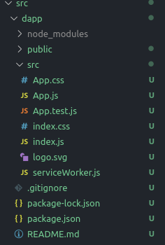

# Oracletest
test interaction between smart contracts and oracle.

```plantuml
actor user
boundary dApp
control EmitOracle
control Oracle

autonumber "<b>[000]"
user -> dApp : Send Message
dApp -> dApp : sign the message
dApp -> EmitOracle : send the message and the signature
EmitOracle -> EmitOracle : Recover the sender address
EmitOracle -> Oracle : send the address and the mssage
Oracle -> Oracle : Store (address, message) in DB
...
user -> dApp : extract the message
dApp -> Oracle : (API) extract emssage by the account adddres
Oracle -> Oracle : search the message by the account address
alt found
    Oracle -> dApp : show the message
else not found
    Oracle -> dApp : return error
end
```

*TODO*

- スマートコントラクトEmitOracleとやりとりするdAPpの実装
- スマートコントラクトEmitOracle側での署名処理
- Oracleサーバー側でのイベントパラメータ値の取り出し
- Oracleサーバー側でのsqllite3への保存
- dAppによるOracleサーバーAPIの呼び出し
- Oracleサーバー側でのAPIの実装





署名時に以下のPopupが表示される


eventが発行されました


